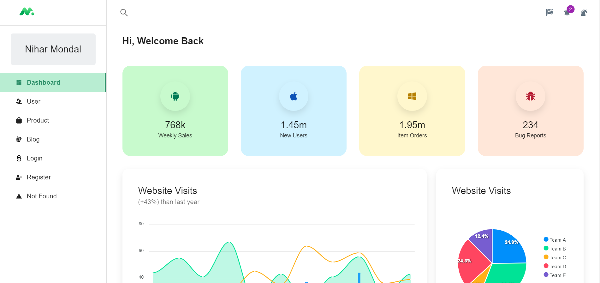

# I tried to copy Minumal Free version 

##  [(Click here to visit Minumal)](https://mui-react-dashboard.netlify.app/dashboard/app)

> Free React Admin Dashboard made with Material-UI components and React.

## Page demo

- [Dashboard](https://mui-react-dashboard.netlify.app/dashboard/app)
- [Users](https://mui-react-dashboard.netlify.app/dashboard/user)
- [Product](https://mui-react-dashboard.netlify.app/dashboard/products)
- [Blog](https://mui-react-dashboard.netlify.app/dashboard/blog)
- [Login](https://mui-react-dashboard.netlify.app/login)
- [Register](https://mui-react-dashboard.netlify.app/register)
- [Not Found](https://mui-react-dashboard.netlify.app/not-found)

## Getting started

- Recommended `node js 14+` and `npm 6+`
- Install dependencies: `npm install` or `yarn install`
- Start the server: `npm run start` or `yarn start`

